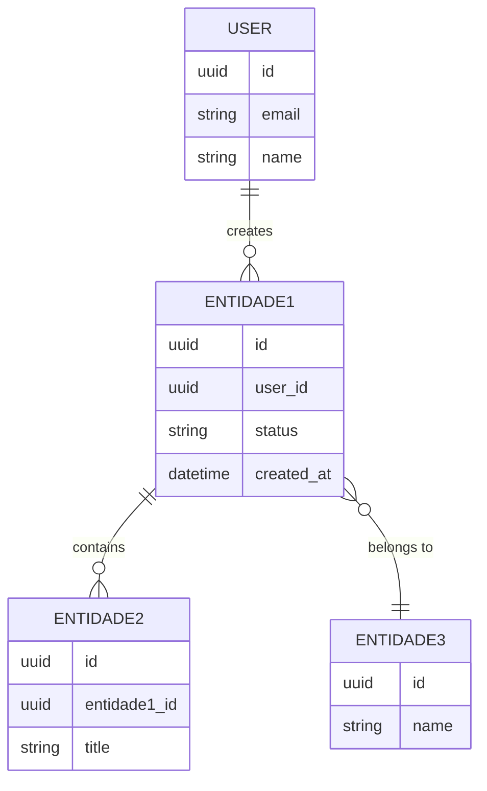
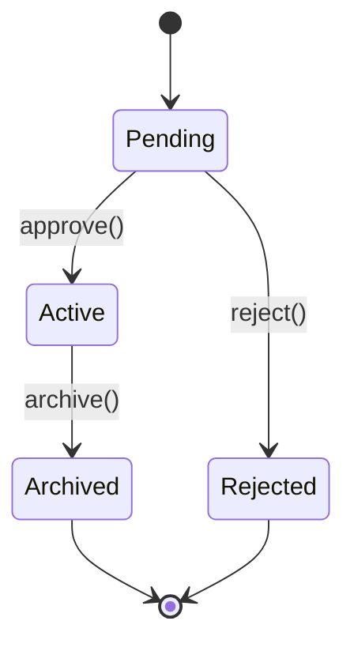

# DOMAIN — <PRODUCT_NAME>

Glossário e modelo de entidades do <DOMAIN>. Quando um termo aparecer no código (variável, classe, endpoint), ele deve estar aqui antes. Quando alguém perguntar "o que é X?", a resposta vem deste arquivo.

> Regra: nada de sinônimos não documentados. Se "usuário" e "cliente" significam a mesma coisa, escolha um e mantenha em todo o repo.

---

## Glossário

Tabela ordenada alfabeticamente. Manter conciso (1-2 linhas por termo).

| Termo | Definição | Onde aparece |
|---|---|---|
| `<Entidade1>` | <Definição curta. Não copiar do dicionário, descrever no contexto do produto.> | DB, API, UI |
| `<Entidade2>` | <Definição.> | DB, API |
| `<Conceito1>` | <Definição.> | Regra de negócio |
| `<Status>` | Estado pelo qual `<Entidade1>` passa: `pending` -> `active` -> `archived`. | DB, UI |
| `<Evento>` | Algo que aconteceu (passado), imutável. Ex: `OrderPlaced`. | Event log |
| `<Comando>` | Pedido para algo acontecer (futuro). Ex: `PlaceOrder`. | API |

---

## Entidades principais

Lista das principais entidades de negócio. Cada uma com 1-3 frases de descrição.

### `<Entidade1>`

- O que é: <descrição>
- Atributos chave: <id, nome, status, ...>
- Ciclo de vida: <criação -> transições -> término>
- Quem cria: <persona>
- Quem consome: <persona ou sistema>

### `<Entidade2>`

- O que é: <descrição>
- Atributos chave: <...>
- Relação com `<Entidade1>`: <1:N, 1:1, N:N e por quê>

### `<Entidade3>`

- O que é: <descrição>
- Atributos chave: <...>
- Regras de negócio: <ex: só pode existir uma ativa por usuário>

---

## Diagrama de entidades

Visão simplificada das relações. Atualizar quando uma entidade nova for criada ou um relacionamento mudar.

---

## Regras de negócio (invariantes)

Coisas que nunca podem ser violadas. Cada uma deve virar teste.

- INV-1: `<Entidade1>` só passa de `pending` para `active` se `<condição>`.
- INV-2: Um `User` não pode ter mais de uma `<Entidade3>` ativa.
- INV-3: `<Evento>` é imutável; nunca edita, sempre acrescenta.
- INV-4: <regra...>

---

## Estados / máquinas de estado

Quando uma entidade tem ciclo de vida não trivial, desenhar.

---

## Termos do <DOMAIN> que NÃO usamos

Sinônimos vetados. Mantém vocabulário consistente.

| Termo vetado | Usar em vez |
|---|---|
| `customer` | `user` |
| `record` | nome da entidade específica |
| `data` | `<o que for, com nome explícito>` |

---

## Histórico

| Data | Mudança | Quem |
|---|---|---|
| YYYY-MM-DD | Criação inicial | <TEAM> |
