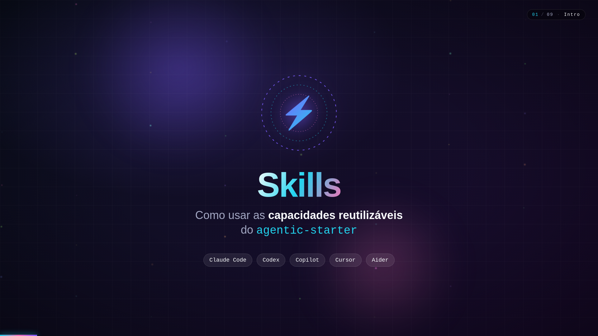
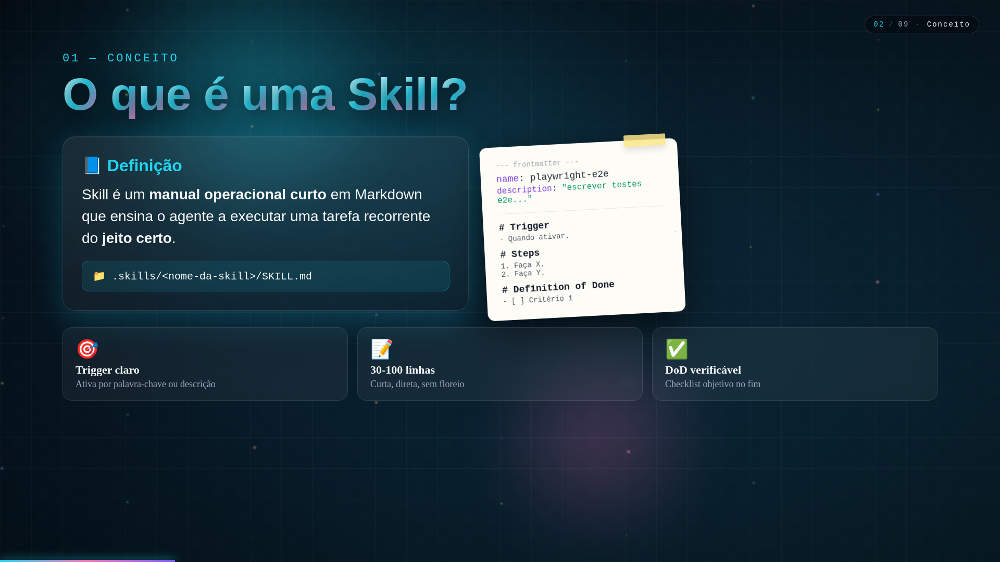
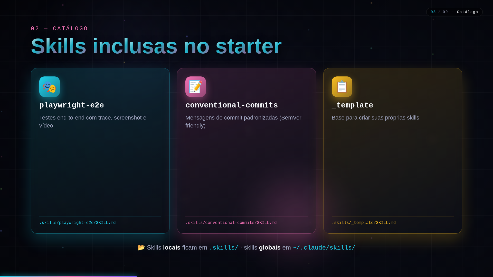
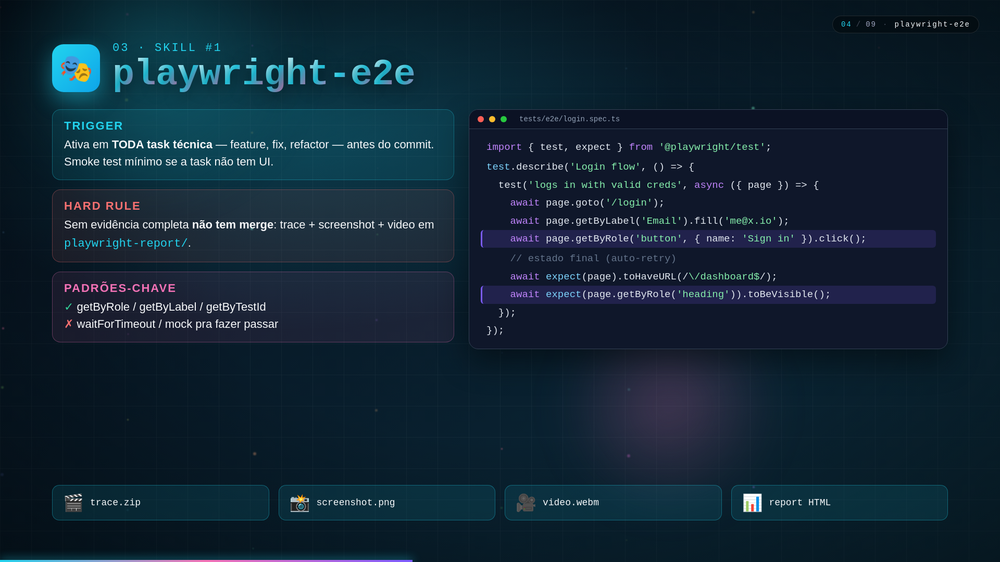
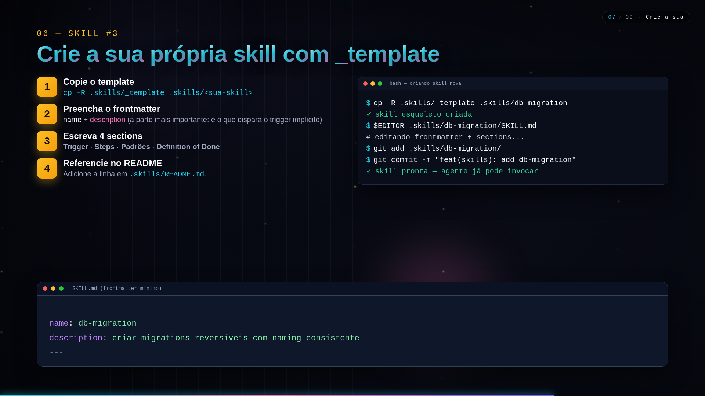

# Agentic Starter Pack

> 🇺🇸 English. Leia em português: [README.pt-BR.md](README.pt-BR.md).

AI-friendly, stack-neutral repository scaffold. Drop it into **any** project — new or existing — and any agent CLI (Claude Code, Codex, Cursor, GitHub Copilot, Aider with Deepseek/Kimi/MiniMax/GLM, Hermes, OpenClaw) gets the context it needs to ship work the same day.

> Starter pack, not a framework. Ships structure, instructions, process. Stack is yours.

---

## TL;DR — get going in 60 seconds

Pick **one** of the install paths below, run it inside your project folder, then let the agent run `INIT.md`.

| OS | Recommended one-liner |
|---|---|
| **macOS** | `npx @wesleysimplicio/agentic-starter` |
| **Linux** | `npx @wesleysimplicio/agentic-starter` |
| **Windows (PowerShell)** | `npx @wesleysimplicio/agentic-starter` |
| **Windows (cmd.exe)** | `npx @wesleysimplicio/agentic-starter` |

Same command everywhere. No bash dependency, no clone, no global install.

---

## 🎬 Skills tutorial video

A 59-second animated tutorial (Remotion · 1080p) that walks through every skill shipped in this starter — what they are, how to invoke them (explicit vs. implicit triggers), the two built-ins (`playwright-e2e`, `conventional-commits`), and how to author your own from `_template`.

[](video/assets/skills-tutorial.mp4)

> 🎥 **Watch the full video:** [`video/assets/skills-tutorial.mp4`](video/assets/skills-tutorial.mp4) (19 MB · 1080p · H.264)
> 🛠️ **Source / re-render:** [`video/`](video/README.md) · `cd video && npm install && npm run build`

<details>
<summary>Embedded player (click to expand)</summary>

<video src="video/assets/skills-tutorial.mp4" controls width="100%"></video>

</details>

### Walkthrough — every scene of the tutorial

Prefer images over a 59-second video? Each scene is captured below at its settled state. Read top-to-bottom for the full skill flow.

#### 01 · Intro — "Skills" hook


> Animated logo + tagline + the agent CLIs that read the same skill files (Claude Code, Codex, Copilot, Cursor, Aider).

#### 02 · What is a skill?



> A skill is a short Markdown manual at `.skills/<name>/SKILL.md` with a frontmatter (`name`, `description`) and four sections: **Trigger**, **Steps**, **Patterns**, **Definition of Done**. Concise, idempotent, single-responsibility.

#### 03 · Catalog — what ships in this starter



> Three skills come baked in: `playwright-e2e`, `conventional-commits`, and `_template` (the base for new skills). Local skills live in `.skills/`, global ones in `~/.claude/skills/`.

#### 04 · Skill #1 — `playwright-e2e`



> Triggers on **every technical task** before commit. Hard rule: no merge without **trace + screenshot + video**. Prefer `getByRole / getByLabel / getByTestId`; never `waitForTimeout` or mocks-to-pass.

#### 05 · Skill #2 — `conventional-commits`


> `<type>(<scope>)?: <subject>` — 10 types covered (`feat`, `fix`, `docs`, `refactor`, `perf`, `test`, `build`, `ci`, `chore`, `style`). Breaking changes use `!` after the type or a `BREAKING CHANGE:` footer. Drives automatic SemVer + changelog.

#### 06 · How to invoke a skill


> Two modes: **explicit** (`$skill-name` in the prompt) and **implicit** (the agent matches your request against each skill's `description` frontmatter). The `description` field is the most important thing in a skill — write it like a query.

#### 07 · Skill #3 — Build your own from `_template`



> `cp -R .skills/_template .skills/<your-skill>` → fill the frontmatter → write the four sections → reference it in `.skills/README.md`. The agent picks it up on the next prompt that matches the description.

#### 08 · Best practices


> Skills that age well are **concise** (30–100 lines), **idempotent**, **single-responsibility**, with **direct language** and a **verifiable DoD**. Don't make a skill for one-off tasks, universal conventions, or generic stack knowledge.

#### 09 · Outro — recap & CTA


> Skills turn repeated conventions into agent superpowers. `cp -R .skills/_template .skills/<your-skill>` and ship the first one today.

---

## Prerequisites

| Requirement | macOS | Linux | Windows |
|---|---|---|---|
| **Node.js >= 16.7** (for `npx`) | `brew install node` | `sudo apt install nodejs npm` (Debian/Ubuntu) · `sudo dnf install nodejs npm` (Fedora) · or [nvm](https://github.com/nvm-sh/nvm) | [nodejs.org installer](https://nodejs.org) or `winget install OpenJS.NodeJS.LTS` |
| **Git** | preinstalled / `brew install git` | `sudo apt install git` / `sudo dnf install git` | [git-scm.com](https://git-scm.com) or `winget install Git.Git` |
| **Bash 4+** (only if you use `bootstrap.sh`) | preinstalled (Bash 3.2 works too) | preinstalled | Git Bash (ships with Git for Windows) or WSL |
| **PowerShell 5.1+ / pwsh 7+** (only for `bootstrap.ps1`) | `brew install --cask powershell` | `sudo snap install powershell --classic` | preinstalled |

Pick **one** runtime: `npx` works everywhere; `bootstrap.sh` for Unix shells; `bootstrap.ps1` for native Windows.

---

## What it ships

```
your-project/
├── AGENTS.md                 # master agent instructions (read by every CLI)
├── CLAUDE.md                 # mirror of AGENTS.md (Claude Code)
├── INIT.md                   # one-shot prompt the agent runs after bootstrap
├── .github/
│   ├── copilot-instructions.md    # mirror of AGENTS.md (Copilot)
│   ├── workflows/                  # CI + Definition-of-Done gate
│   ├── PULL_REQUEST_TEMPLATE.md
│   └── ISSUE_TEMPLATE/
├── .specs/                   # canonical docs (specs as code)
│   ├── product/              # VISION, DOMAIN, PERSONAS
│   ├── architecture/         # DESIGN, PATTERNS, ADRs
│   ├── workflow/             # WORKFLOW, CONTRIBUTING, RELEASE
│   └── sprints/              # BACKLOG + sprint folders
├── .skills/                  # reusable agent skills
├── .agents/                  # custom sub-agents
├── .claude/                  # Claude Code config + hooks
├── .codex/                   # Codex CLI config
├── playwright.config.ts      # default E2E
└── presentation/             # method slides (Marp)
```

Stack-neutral: anything specific to your stack gets filled by `INIT.md` when the agent inspects the real code.

---

## Install paths

### A. `npx` — recommended, cross-platform, zero clone

```bash
# inside your project folder (works on macOS, Linux, Windows)
npx @wesleysimplicio/agentic-starter
```

Runs interactively. Asks **only**:

1. **Which CLI/LLM to hand off to** (auto-detects which ones are installed and marks them `[installed]`).
2. **Append recommended ignores to `.gitignore`?** (yes/no — never overwrites your existing `.gitignore`).

Everything else — `PRODUCT_NAME`, stack, dependencies — auto-detected from `package.json` / `pyproject.toml` / `go.mod` / `*.csproj` / `Cargo.toml` / `pubspec.yaml` / `composer.json` / `Gemfile` / `mix.exs` / `pom.xml` / `build.gradle*`.

#### Non-interactive (CI / scripts)

```bash
npx @wesleysimplicio/agentic-starter --yes --cli skip --append-gitignore no
```

#### Preview without writing

```bash
npx @wesleysimplicio/agentic-starter --dry-run --yes
```

#### Full flag list

| Flag | Purpose |
|---|---|
| `-y, --yes` | Non-interactive (defaults: no `.gitignore` append, skip CLI handoff) |
| `-f, --force` | Overwrite starter template files. **Never** touches user instruction files (`AGENTS.md`, `CLAUDE.md`, `INIT.md`, `.github/copilot-instructions.md`, `.gitignore`) |
| `--dry-run` | Print actions without writing |
| `--cli <key>` | Pick CLI for `INIT.md` handoff: `claude`, `codex`, `copilot`, `cursor`, `deepseek`, `kimi`, `minimax`, `glm`, `hermes`, `openclaw`, `aider`, `other`, `skip` |
| `--append-gitignore <yes\|no>` | Append recommended ignores to `.gitignore` |
| `--skip-meta` | Do not write `.starter-meta.json` |
| `--silent` | Minimal output |
| `-v, --version` | Print version |
| `-h, --help` | Show help |

### B. `bootstrap.sh` — Unix shells (macOS / Linux / Git Bash / WSL)

Clone the starter and run the script:

```bash
git clone --depth=1 https://github.com/wesleysimplicio/agentic-starter.git tmp-starter
cp -R tmp-starter/. ./ && rm -rf tmp-starter
chmod +x ./bootstrap.sh   # only the first time
./bootstrap.sh
```

### C. `bootstrap.ps1` — native Windows (PowerShell)

```powershell
git clone --depth=1 https://github.com/wesleysimplicio/agentic-starter.git tmp-starter
Copy-Item -Recurse -Force tmp-starter\* .\
Remove-Item -Recurse -Force tmp-starter

# PowerShell 7+ (pwsh)
pwsh -File .\bootstrap.ps1

# PowerShell 5.1 (built-in on Windows 10/11)
powershell -ExecutionPolicy Bypass -File .\bootstrap.ps1
```

All three paths produce the same result and ask the same two questions.

---

## CLI handoff — supported agents

After scaffolding, the bootstrap asks which CLI/LLM to launch with `INIT.md`. Detected installs get a `[installed]` mark in the menu.

| # | CLI / LLM | Native agent loop? | Install docs |
|---|---|---|---|
| 1 | **Claude Code** | yes | <https://docs.claude.com/claude-code> |
| 2 | **Codex CLI** | yes | <https://github.com/openai/codex> |
| 3 | **GitHub Copilot CLI** | no — paste prompt manually | `gh extension install github/gh-copilot` |
| 4 | **Cursor Agent** | yes | `npm i -g cursor-agent` (or Cursor IDE) |
| 5 | **Deepseek** (via Aider) | yes | `pip install aider-chat` |
| 6 | **Kimi K2.6** (via Aider, OpenRouter) | yes | `pip install aider-chat` |
| 7 | **MiniMax M2.7** (via Aider, OpenRouter) | yes | `pip install aider-chat` |
| 8 | **GLM 5.1** (via Aider, OpenRouter) | yes | `pip install aider-chat` |
| 9 | **Hermes Agent** (Nous Research) | yes | <https://github.com/NousResearch> |
| 10 | **OpenClaw** | yes | <https://github.com/openclaw> |
| 11 | **Aider** (pick model interactively) | yes | `pip install aider-chat` |
| 12 | Other / manual (clipboard) | — | — |
| 13 | Skip — run `INIT.md` later | — | — |

For Copilot CLI (no native agent loop), the bootstrap copies the prompt to your clipboard (`pbcopy` on macOS, `xclip`/`wl-copy` on Linux, `clip.exe` on Windows/WSL) and you paste it into Copilot Chat.

---

## What `INIT.md` does — the safety contract

When the chosen CLI runs `INIT.md`, it reads `.starter-meta.json` and follows three hard rules:

1. **`read_only_globs` are intouchable.** Any file matching these globs (`**/*.razor`, `**/*.cs`, `**/*.csproj`, `**/*.sln`, `package.json`, `pnpm-lock.yaml`, `yarn.lock`, `package-lock.json`, `**/*.py`, `**/*.go`, `**/*.rs`, `**/*.java`, `**/*.kt`, `**/*.dart`, `**/*.php`, `**/*.rb`) is read-only. The agent reads it for context but never writes. If `git status` shows any after init — that is a bug.
2. **`init_must_merge` preserves your essence.** If `AGENTS.md` / `CLAUDE.md` / `.github/copilot-instructions.md` already existed before bootstrap, the agent **reads them**, **preserves the content**, and **merges** the starter structure on top. Never a clean rewrite.
3. **`init_must_ask` only asks 4 things.** `team`, `domain`, `vision_oneliner`, `primary_personas` — once, in a single message. Everything else (`product_name`, `stack`) is auto-detected.

The agent then writes — and only writes — inside the whitelist:

```
.specs/**          .agents/**         .skills/**
.claude/**         .codex/**
.github/copilot-instructions.md
.github/copilot/**
.github/PULL_REQUEST_TEMPLATE.md
.github/ISSUE_TEMPLATE/**
.github/workflows/ci.yml
.github/workflows/dod.yml
AGENTS.md  CLAUDE.md  README.md  README.pt-BR.md
playwright.config.ts (only if missing or our template)
```

Anything outside this whitelist **and** not from the starter template = untouched.

---

## Troubleshooting

### macOS / Linux

| Symptom | Fix |
|---|---|
| `./bootstrap.sh: Permission denied` | `chmod +x ./bootstrap.sh` |
| `command not found: npx` | Install Node.js (see Prerequisites) |
| `Claude Code not installed` after pick | Install Claude Code or pick `[12] Other` to copy the prompt to clipboard |
| Old Bash on macOS (`bash --version` shows 3.2) | Works — script is Bash 3.2-compatible. If problems, `brew install bash` for Bash 5+ |

### Windows

| Symptom | Fix |
|---|---|
| `bootstrap.ps1 cannot be loaded ... execution policy` | Run with `powershell -ExecutionPolicy Bypass -File .\bootstrap.ps1` (per-session bypass, no permanent change) |
| Line endings broken when running `.sh` from Git Bash | `git config --global core.autocrlf input` then re-clone |
| `npx` not found in cmd.exe | Open new terminal after Node install (refreshes PATH), or use full path `C:\Program Files\nodejs\npx.cmd` |
| `pwsh` not found | You have PowerShell 5.1 (built-in) — use the `powershell -ExecutionPolicy Bypass ...` form. To install pwsh 7: `winget install Microsoft.PowerShell` |

### Cross-platform

| Symptom | Fix |
|---|---|
| Bootstrap exits with `aborting: existing files would be overwritten` | Re-run with `--force` (only overwrites starter template files, never your instruction files) |
| `git status` shows `package.json` / source files modified after init | Stop. That is a `read_only_globs` violation. Open an issue with the file path |
| `.gitignore` got rewritten | The starter never overwrites it — only appends if you said `yes`. If yours was replaced, you ran `--force`; restore from git |
| Want to re-run `INIT.md` later | `claude "$(cat INIT.md)"` (or equivalent for your CLI). The handoff is just a launcher |

---

## Suggested reading order (human)

1. `README.md` (this file) — overview.
2. `AGENTS.md` — agent master instruction.
3. `.specs/README.md` — specs navigation map.
4. `.specs/product/VISION.md` — product context.
5. `.specs/architecture/DESIGN.md` — architecture.
6. `.specs/workflow/WORKFLOW.md` — process.
7. `.skills/README.md` — agent capabilities.

---

## Quickstart for the agent (after `INIT.md`)

1. Read `AGENTS.md` (root). That is the contract.
2. Read `.specs/product/VISION.md` for the why.
3. Read `.specs/architecture/DESIGN.md` and `PATTERNS.md` for the how.
4. Pull the next task from `.specs/sprints/sprint-XX/`.
5. Run the mandatory loop: read task → plan → edit → lint → unit → e2e → fix → commit.
6. Validate Definition of Done before opening a PR.

---

## Optional: clean up starter files

After the agent finishes `INIT.md`, the bootstrap files are no longer needed.

**macOS / Linux / Git Bash / WSL:**

```bash
rm _BOOTSTRAP.md INIT.md bootstrap.sh bootstrap.ps1
git add -A && git commit -m "chore: remove starter bootstrap files"
```

**Windows PowerShell:**

```powershell
Remove-Item _BOOTSTRAP.md, INIT.md, bootstrap.sh, bootstrap.ps1
git add -A; git commit -m "chore: remove starter bootstrap files"
```

`.starter-meta.json` stays as a reference for future re-runs.

---

## Philosophy

- **Specs as code.** What is not in `.specs/`, the agent does not see.
- **Atomic tasks.** One task = one small reviewable PR.
- **Automated DoD.** What does not pass the gate, does not merge.
- **Reusable skills.** A capability that becomes a pattern becomes a `SKILL.md`.
- **Tight loop.** Edit, test, fix, repeat. Never accumulate invisible debt.
- **Never destroy.** User files are read-only; starter files merge instead of overwrite.

---

## License

`<LICENSE_PLACEHOLDER>` (replace with MIT, Apache-2.0, proprietary, or whatever fits).

---

## Next steps

- Run the bootstrap.
- Let the agent execute `INIT.md`.
- Fill specs with real product context (the agent does most of this from the code).
- Run the first sprint using `.specs/sprints/sprint-01/`.
- Watch `presentation/ai-agent-specialist.pdf` for the full method.
