# LLM Project Mapper

> 🇧🇷 Versão em português. Read this in English: [README.md](README.md).

Esqueleto de repositório AI-friendly, neutro de stack. Joga em **qualquer** projeto — novo ou existente — e qualquer agente CLI (Claude Code, Codex, Cursor, GitHub Copilot, Aider com Deepseek/Kimi/MiniMax/GLM, Hermes, OpenClaw) ganha o contexto que precisa pra entregar trabalho no mesmo dia.

> Starter pack, não framework. Entrega estrutura, instruções, processo. A stack é sua.


> Resumo visual: joga o starter em um projeto baguncado e ele transforma contexto espalhado em estrutura, skills reutilizaveis, testes, docs e guardrails para agentes de coding.

### Assista: por que llm-project-mapper? (53s)

[](https://github.com/wesleysimplicio/llm-project-mapper/raw/main/video/assets/why-llm-project-mapper.mp4)

> Clica na capa pra rodar. Link direto: [`video/assets/why-llm-project-mapper.mp4`](video/assets/why-llm-project-mapper.mp4) · Versão em inglês: [`video/assets/why-llm-project-mapper-en.mp4`](video/assets/why-llm-project-mapper-en.mp4).

---

## Documentação operacional para agentes

Este starter agora inclui templates genéricos e preenchíveis para deixar qualquer projeto mais fácil de operar por agentes:

- `docs/local-setup.md`: como instalar, subir, validar e acessar o projeto.
- `docs/domain-map.md`: conceitos de negócio, regras críticas e casos especiais.
- `docs/architecture-map.md`: formato do sistema, caminho da requisição e integrações.
- `docs/features/README.md`: template de feature com arquivos, endpoints, regras e evidências.
- `docs/evidence/README.md`: política de screenshot/video/trace e nome de artefatos.
- `docs/troubleshooting.md`: diagnóstico e correções repetíveis.
- `scripts/`: placeholders neutros de stack para start, test e evidência.
- `tests/e2e/smoke.spec.ts`: smoke test Playwright genérico baseado em `BASE_URL`.

Preencha esses arquivos depois de instalar o starter em um projeto real. O objetivo é reduzir tempo de descoberta para humanos e agentes sem impor framework.

---

## TL;DR — começa em 60 segundos

Escolha **um** caminho de instalação abaixo e rode dentro da pasta do projeto. O bootstrap agora inicia automaticamente um mapeamento local e preenche a primeira versão dos arquivos; o `INIT.md` vira uma etapa opcional de refinamento com agente.

| SO | Comando único recomendado |
|---|---|
| **macOS** | `npx @wesleysimplicio/llm-project-mapper` |
| **Linux** | `npx @wesleysimplicio/llm-project-mapper` |
| **Windows (PowerShell)** | `npx @wesleysimplicio/llm-project-mapper` |
| **Windows (cmd.exe)** | `npx @wesleysimplicio/llm-project-mapper` |

Mesmo comando em todo lugar. Sem dependência de bash, sem clone, sem instalação global.

---

## O que o LLM Project Mapper muda

O ponto do starter nao e "mais arquivos". E acelerar execucao por agentes com menos ambiguidade, menos conhecimento tribal e loops de entrega mais seguros.

#### 01 · De caos de projeto para estrutura operacional


> Joga o starter em um codigo existente e ele converte contexto espalhado em docs repetiveis, validacao, instrucoes para agentes e guardrails de entrega.

#### 02 · Contexto compartilhado para agentes em paralelo


> Os agentes deixam de agir como chats isolados e passam a colaborar sobre o mesmo mapa de projeto: arquitetura, tarefas, checks e expectativa de saida.

#### 03 · Base estavel para ganhar velocidade com seguranca


> O estado final e uma base pronta para agentes: contexto de dominio, arquitetura, workflow, gates de qualidade e trilhas de evidencia que tornam a automacao confiavel em vez de arriscada.

---

## Pré-requisitos

| Requisito | macOS | Linux | Windows |
|---|---|---|---|
| **Node.js >= 16.7** (para `npx`) | `brew install node` | `sudo apt install nodejs npm` (Debian/Ubuntu) · `sudo dnf install nodejs npm` (Fedora) · ou [nvm](https://github.com/nvm-sh/nvm) | [nodejs.org installer](https://nodejs.org) ou `winget install OpenJS.NodeJS.LTS` |
| **Git** | preinstalado / `brew install git` | `sudo apt install git` / `sudo dnf install git` | [git-scm.com](https://git-scm.com) ou `winget install Git.Git` |
| **Bash 4+** (só pra `bootstrap.sh`) | preinstalado (Bash 3.2 também roda) | preinstalado | Git Bash (vem com Git for Windows) ou WSL |
| **PowerShell 5.1+ / pwsh 7+** (só pra `bootstrap.ps1`) | `brew install --cask powershell` | `sudo snap install powershell --classic` | preinstalado |

Escolha **um** runtime: `npx` funciona em todo lugar; `bootstrap.sh` pra shells Unix; `bootstrap.ps1` pra Windows nativo.

---

## O que vem dentro

```
seu-projeto/
├── AGENTS.md                 # instruções mestre (lidas por toda CLI)
├── CLAUDE.md                 # espelho de AGENTS.md (Claude Code)
├── INIT.md                   # prompt one-shot que o agente roda após bootstrap
├── .github/
│   ├── copilot-instructions.md    # espelho de AGENTS.md (Copilot)
│   ├── workflows/                  # CI + gate de Definition of Done
│   ├── PULL_REQUEST_TEMPLATE.md
│   └── ISSUE_TEMPLATE/
├── .specs/                   # docs canônicas (specs como código)
│   ├── product/              # VISION, DOMAIN, PERSONAS
│   ├── architecture/         # DESIGN, PATTERNS, ADRs
│   ├── workflow/             # WORKFLOW, CONTRIBUTING, RELEASE
│   └── sprints/              # BACKLOG + pastas de sprint
├── .skills/                  # skills reutilizáveis do agente
├── .agents/                  # sub-agents customizados
├── .claude/                  # config + hooks Claude Code
├── .codex/                   # config Codex CLI
├── playwright.config.ts      # E2E padrão
└── presentation/             # slides do método (Marp)
```

Neutro de stack: a primeira passada agora é preenchida automaticamente a partir do código real, e o `INIT.md` continua disponível para refinamento mais profundo com agente.

---

## Caminhos de instalação

### A. `npx` — recomendado, cross-platform, zero clone

```bash
# dentro da pasta do projeto (funciona em macOS, Linux, Windows)
npx @wesleysimplicio/llm-project-mapper
```

Roda interativo. Pergunta **só**:

1. **Qual CLI/LLM usar pro handoff depois do mapeamento automático** (auto-detecta quais estão instaladas e marca `[installed]`).
2. **Adicionar ignores recomendados ao `.gitignore`?** (sim/não — nunca sobrescreve o seu `.gitignore` existente).

Tudo o resto — `PRODUCT_NAME`, stack, dependências — auto-detectado de `package.json` / `pyproject.toml` / `go.mod` / `*.csproj` / `Cargo.toml` / `pubspec.yaml` / `composer.json` / `Gemfile` / `mix.exs` / `pom.xml` / `build.gradle*`.

#### Não-interativo (CI / scripts)

```bash
npx @wesleysimplicio/llm-project-mapper --yes --cli skip --append-gitignore no
```

#### Atualizar um overlay existente

```bash
npx @wesleysimplicio/llm-project-mapper@latest --update
```

Equivale a `--yes --force --append-gitignore yes --cli skip`: atualiza arquivos gerenciados pelo starter, atualiza o bloco do `.gitignore`, preserva arquivos de instrução existentes e não abre handoff para agente.

#### Preview sem escrever

```bash
npx @wesleysimplicio/llm-project-mapper --dry-run --yes
```

#### Lista completa de flags

| Flag | Para que serve |
|---|---|
| `-y, --yes` | Não-interativo (defaults: sem append no `.gitignore`, pula handoff) |
| `-f, --force` | Sobrescreve arquivos do template do starter. **Nunca** toca arquivos de instrução do usuário (`AGENTS.md`, `CLAUDE.md`, `INIT.md`, `.github/copilot-instructions.md`, `.gitignore`) |
| `--update` | Modo seguro para atualizar overlay existente: força arquivos do starter, atualiza `.gitignore`, pula handoff |
| `--dry-run` | Imprime ações sem escrever |
| `--cli <key>` | Escolhe CLI pro handoff do `INIT.md`: `claude`, `codex`, `copilot`, `cursor`, `deepseek`, `kimi`, `minimax`, `glm`, `hermes`, `openclaw`, `aider`, `other`, `skip` |
| `--append-gitignore <yes\|no>` | Adiciona ignores recomendados ao `.gitignore` |
| `--skip-meta` | Não escreve `.starter-meta.json` |
| `--silent` | Saída mínima |
| `-v, --version` | Mostra versão |
| `-h, --help` | Mostra ajuda |

### B. `bootstrap.sh` — shells Unix (macOS / Linux / Git Bash / WSL)

Clona o starter e roda o script:

```bash
git clone --depth=1 https://github.com/wesleysimplicio/llm-project-mapper.git tmp-starter
cp -R tmp-starter/. ./ && rm -rf tmp-starter
chmod +x ./bootstrap.sh   # só na primeira vez
./bootstrap.sh
```

### C. `bootstrap.ps1` — Windows nativo (PowerShell)

```powershell
git clone --depth=1 https://github.com/wesleysimplicio/llm-project-mapper.git tmp-starter
Copy-Item -Recurse -Force tmp-starter\* .\
Remove-Item -Recurse -Force tmp-starter

# PowerShell 7+ (pwsh)
pwsh -File .\bootstrap.ps1

# PowerShell 5.1 (built-in no Windows 10/11)
powershell -ExecutionPolicy Bypass -File .\bootstrap.ps1
```

Os três caminhos produzem o mesmo resultado e fazem as mesmas duas perguntas.

### D. Overlay em projeto existente (privado, gitignored)

Quer colocar o starter num projeto que já tem git próprio, **sem poluir o repo do host**? Cada dev instala localmente, os arquivos ficam gitignored. Passo-a-passo completo em [INSTALL.md](INSTALL.md). Versão curta:



```bash
# dentro da raiz do projeto host
git clone --depth=1 https://github.com/wesleysimplicio/llm-project-mapper.git /tmp/llm-project-mapper-src
# --ignore-existing protege package.json/README.md/etc do host de serem sobrescritos
rsync -av --ignore-existing --exclude='.git' /tmp/llm-project-mapper-src/ ./
rm -rf /tmp/llm-project-mapper-src
# PRIMEIRO acrescenta o bloco "LLM Project Mapper (overlay privado)" do INSTALL.md no .gitignore
# DEPOIS roda o bootstrap
./bootstrap.sh
```

---

## Handoff de CLI — agentes suportados

Após o scaffold e o mapeamento automático, o bootstrap pode lançar uma CLI/LLM com o `INIT.md` para uma segunda passada opcional. Instalações detectadas ganham `[installed]` no menu.

| # | CLI / LLM | Loop de agente nativo? | Docs de instalação |
|---|---|---|---|
| 1 | **Claude Code** | sim | <https://docs.claude.com/claude-code> |
| 2 | **Codex CLI** | sim | <https://github.com/openai/codex> |
| 3 | **GitHub Copilot CLI** | não — cola prompt manual | `gh extension install github/gh-copilot` |
| 4 | **Cursor Agent** | sim | `npm i -g cursor-agent` (ou Cursor IDE) |
| 5 | **Deepseek** (via Aider) | sim | `pip install aider-chat` |
| 6 | **Kimi K2.6** (via Aider, OpenRouter) | sim | `pip install aider-chat` |
| 7 | **MiniMax M2.7** (via Aider, OpenRouter) | sim | `pip install aider-chat` |
| 8 | **GLM 5.1** (via Aider, OpenRouter) | sim | `pip install aider-chat` |
| 9 | **Hermes Agent** (Nous Research) | sim | <https://github.com/NousResearch> |
| 10 | **OpenClaw** | sim | <https://github.com/openclaw> |
| 11 | **Aider** (escolhe modelo interativo) | sim | `pip install aider-chat` |
| 12 | Outro / manual (clipboard) | — | — |
| 13 | Pular — rodo `INIT.md` depois | — | — |

Pra Copilot CLI (sem loop de agente nativo), o bootstrap copia o prompt pro clipboard (`pbcopy` no macOS, `xclip`/`wl-copy` no Linux, `clip.exe` no Windows/WSL) e você cola no Copilot Chat.

---

## O que `INIT.md` faz — o contrato de segurança

Quando a CLI escolhida roda `INIT.md`, ela lê `.starter-meta.json` e segue três regras inegociáveis:

1. **`read_only_globs` são intocáveis.** Qualquer arquivo casando esses globs (`**/*.razor`, `**/*.cs`, `**/*.csproj`, `**/*.sln`, `package.json`, `pnpm-lock.yaml`, `yarn.lock`, `package-lock.json`, `**/*.py`, `**/*.go`, `**/*.rs`, `**/*.java`, `**/*.kt`, `**/*.dart`, `**/*.php`, `**/*.rb`) é read-only. O agente lê pra contexto mas nunca escreve. Se `git status` mostra qualquer um após init — é bug.
2. **`init_must_merge` preserva sua essência.** Se `AGENTS.md` / `CLAUDE.md` / `.github/copilot-instructions.md` já existiam antes do bootstrap, o agente **lê eles**, **preserva o conteúdo**, e **mescla** a estrutura do starter por cima. Nunca reescreve do zero.
3. **`init_must_ask` pergunta só 4 coisas.** `team`, `domain`, `vision_oneliner`, `primary_personas` — uma vez, em uma única mensagem. Tudo mais (`product_name`, `stack`) é auto-detectado.

O agente então escreve — e só escreve — dentro da whitelist:

```
.specs/**          .agents/**         .skills/**
.claude/**         .codex/**
.github/copilot-instructions.md
.github/copilot/**
.github/PULL_REQUEST_TEMPLATE.md
.github/ISSUE_TEMPLATE/**
.github/workflows/ci.yml
.github/workflows/dod.yml
AGENTS.md  CLAUDE.md  README.md  README.pt-BR.md
playwright.config.ts (só se faltando ou for nosso template)
```

Qualquer coisa fora dessa whitelist **e** que não vem do template do starter = não tocada.

---

## Troubleshooting

### macOS / Linux

| Sintoma | Solução |
|---|---|
| `./bootstrap.sh: Permission denied` | `chmod +x ./bootstrap.sh` |
| `command not found: npx` | Instala Node.js (ver Pré-requisitos) |
| `Claude Code not installed` após escolher | Instala o Claude Code ou escolhe `[12] Other` pra copiar o prompt pro clipboard |
| Bash antigo no macOS (`bash --version` mostra 3.2) | Funciona — script é Bash 3.2-compatível. Se der problema, `brew install bash` pra Bash 5+ |

### Windows

| Sintoma | Solução |
|---|---|
| `bootstrap.ps1 cannot be loaded ... execution policy` | Roda com `powershell -ExecutionPolicy Bypass -File .\bootstrap.ps1` (bypass por sessão, sem mudança permanente) |
| Line endings quebrados ao rodar `.sh` no Git Bash | `git config --global core.autocrlf input` e re-clona |
| `npx` não achado no cmd.exe | Abre novo terminal após instalar Node (atualiza PATH), ou usa caminho completo `C:\Program Files\nodejs\npx.cmd` |
| `pwsh` não encontrado | Você tem PowerShell 5.1 (built-in) — usa o formato `powershell -ExecutionPolicy Bypass ...`. Pra instalar pwsh 7: `winget install Microsoft.PowerShell` |

### Cross-platform

| Sintoma | Solução |
|---|---|
| Bootstrap sai com `aborting: existing files would be overwritten` | Re-roda com `--force` (só sobrescreve arquivos do template do starter, nunca seus arquivos de instrução) |
| `git status` mostra `package.json` / arquivos fonte modificados após init | Para. Isso é violação de `read_only_globs`. Abre issue com o caminho do arquivo |
| `.gitignore` foi reescrito | O starter nunca sobrescreve — só adiciona se você disse `yes`. Se o seu foi substituído, você rodou `--force`; restaura pelo git |
| Quero re-rodar `INIT.md` depois | `claude "$(cat INIT.md)"` (ou equivalente da sua CLI). O handoff é só um lançador |

---

## Ordem de leitura sugerida (humano)

1. `README.md` (este arquivo) — visão geral.
2. `AGENTS.md` — instrução mestre do agente.
3. `.specs/README.md` — mapa de navegação das specs.
4. `.specs/product/VISION.md` — contexto do produto.
5. `.specs/architecture/DESIGN.md` — arquitetura.
6. `.specs/workflow/WORKFLOW.md` — processo.
7. `.skills/README.md` — capacidades do agente.

---

## Quickstart pro agente (depois do `INIT.md`)

1. Lê `AGENTS.md` (raiz). Esse é o contrato.
2. Lê `.specs/product/VISION.md` pro porquê.
3. Lê `.specs/architecture/DESIGN.md` e `PATTERNS.md` pro como.
4. Pega a próxima task em `.specs/sprints/sprint-XX/`.
5. Roda o loop obrigatório: ler task → planejar → editar → lint → unit → e2e → corrigir → commit.
6. Valida Definition of Done antes de abrir PR.

---

## Opcional: limpar arquivos do starter

Após o agente terminar `INIT.md`, os arquivos de bootstrap não são mais necessários.

**macOS / Linux / Git Bash / WSL:**

```bash
rm _BOOTSTRAP.md INIT.md bootstrap.sh bootstrap.ps1
git add -A && git commit -m "chore: remove starter bootstrap files"
```

**Windows PowerShell:**

```powershell
Remove-Item _BOOTSTRAP.md, INIT.md, bootstrap.sh, bootstrap.ps1
git add -A; git commit -m "chore: remove starter bootstrap files"
```

`.starter-meta.json` fica como referência pra re-runs futuros.

---

## Ferramentas complementares

- **Extensão VS Code** — `vscode-extension/` traz TreeView lateral para `.specs/sprints/` + comandos pra abrir task atual, criar ADRs e disparar `INIT.md`. Veja [vscode-extension/README.md](vscode-extension/README.md). Será publicada no Marketplace como `wesleysimplicio.llm-project-mapper-vscode`.
- **Telemetria (opt-in)** — `bin/cli.js` aceita `--telemetry on|off`. Default é off. Veja [PRIVACY.md](PRIVACY.md) para o payload exato e como subir seu próprio [`telemetry-worker.js`](.github/workflows-templates/telemetry-worker.js).

---

## Filosofia

- **Specs como código.** O que não está em `.specs/`, o agente não vê.
- **Tasks atômicas.** Uma task = um PR pequeno e revisável.
- **DoD automatizada.** O que não passa no gate, não merge.
- **Skills reutilizáveis.** Capacidade que vira padrão, vira `SKILL.md`.
- **Loop curto.** Editar, testar, corrigir, repetir. Nunca acumular dívida invisível.
- **Nunca destruir.** Arquivos do usuário são read-only; arquivos do starter mesclam ao invés de sobrescrever.

---

## Licença

[MIT](LICENSE) © 2026 Wesley Simplicio.

---

## Próximos passos

- Roda o bootstrap.
- Deixa o agente executar `INIT.md`.
- Preenche specs com contexto real do produto (o agente faz a maior parte a partir do código).
- Roda a primeira sprint usando `.specs/sprints/sprint-01/`.
- Vê `presentation/ai-agent-specialist.pdf` pro método completo.
