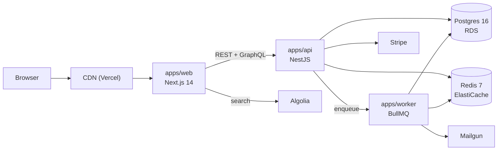

# Architecture Map

Use this file to help agents understand how the system is wired before changing code.

## System Shape

- Type: `<FRONTEND_ONLY | BACKEND_ONLY | FULLSTACK | API | WORKER | MONOREPO>`
- Frontend: `<FRAMEWORK_OR_NONE>`
- Backend: `<FRAMEWORK_OR_NONE>`
- Database: `<DATABASE_OR_NONE>`
- Jobs/workers: `<WORKERS_OR_NONE>`
- External integrations: `<INTEGRATIONS>`

## Local URLs

| Service | URL | Notes |
|---|---|---|
| Frontend | `<FRONTEND_URL>` | `<NOTES>` |
| Backend | `<BACKEND_URL>` | `<NOTES>` |

## Request Path

Describe the usual end-to-end path:

```text
Browser/client -> <FRONTEND_ROUTE> -> <API_ENDPOINT> -> <SERVICE> -> <REPOSITORY> -> <DATABASE> -> response
```

## Key Directories

| Directory | Purpose |
|---|---|
| `<PATH>` | `<PURPOSE>` |

## Authentication

- Flow: `<AUTH_FLOW>`
- Local/demo credentials: `<WHERE_TO_FIND_THEM>`
- Token/session storage: `<COOKIE_HEADER_STORAGE>`
- Common failure mode: `<AUTH_FAILURE>`

## Observability

- App logs: `<LOG_LOCATION>`
- API logs: `<LOG_LOCATION>`
- Job logs: `<LOG_LOCATION>`
- How to identify current request: `<CORRELATION_ID_OR_TRACE>`

## Deployment

- Environments: `<ENVIRONMENTS>`
- CI/CD: `<PIPELINE>`
- Release notes/changelog: `<LOCATION>`

---

## EXAMPLE — fictional shop SaaS (delete or copy as a starting point)

Below is what a real, filled-in version of this file might look like. Use it as a reference for the level of detail an agent expects.

### System Shape

- Type: FULLSTACK + MONOREPO
- Frontend: Next.js 14 (App Router, RSC)
- Backend: NestJS 10 (Express adapter)
- Database: Postgres 16 + Redis 7 (cache + queues)
- Jobs/workers: BullMQ workers under `apps/worker/`
- External integrations: Stripe (payments), Mailgun (email), Algolia (search)

### Local URLs

| Service | URL | Notes |
|---|---|---|
| Frontend | `http://localhost:3000` | `apps/web` |
| Backend | `http://localhost:4000` | `apps/api`, GraphQL at `/graphql` |
| Worker dashboard | `http://localhost:4001` | Bull board UI |

### C4 — Container diagram



### Request Path — checkout

```text
Browser -> /checkout (RSC) -> POST /api/v1/orders -> OrdersController
        -> OrdersService.create -> OrdersRepository.insert -> Postgres
        -> StripeService.createPaymentIntent -> Stripe API
        -> response { order, client_secret } -> Stripe.confirmPayment (browser)
        -> webhook POST /webhooks/payment -> orders.completed event -> worker fulfills
```

### Authentication

- Flow: OAuth2 (PKCE) with Auth0 + first-party JWT (15 min) + refresh-token cookie (30 days, httpOnly+secure+sameSite=lax).
- Local/demo credentials: see 1Password vault `shop-saas-dev`.
- Token/session storage: access token in memory, refresh in httpOnly cookie.
- Common failure mode: clock skew with Auth0 — agents must check that workstation clock is synced before debugging 401s.

### Observability

- App logs: Vercel runtime logs + `pnpm --filter web dev` stdout.
- API logs: structured JSON to stdout, shipped via Vector to Datadog.
- Job logs: `apps/worker` logs to Datadog with `worker:true` tag.
- How to identify current request: `X-Request-Id` header (UUID v7) — propagated to all downstream calls and added as `request_id` field on every log entry.

### Deployment

- Environments: `dev` (preview Vercel per PR), `staging` (auto from `main`), `prod` (manual promote, weekly).
- CI/CD: GitHub Actions `.github/workflows/{ci,deploy-staging,deploy-prod}.yml`.
- Release notes/changelog: `CHANGELOG.md` + GitHub Releases (auto-generated from PR titles).

