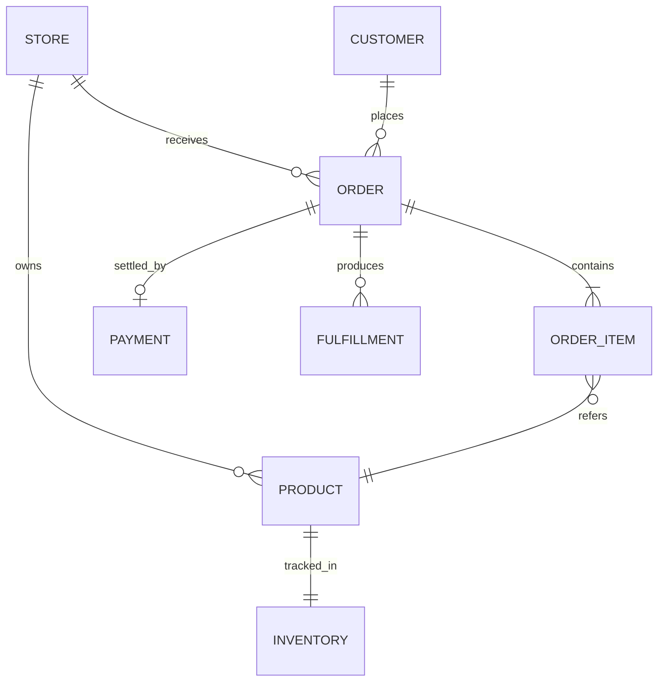

# Domain Map

Use this file to give agents the shortest reliable path from a user request to the business rule behind it.

## Product Context

- App: `<APP_NAME>`
- Main users: `<USER_TYPES>`
- Main business goal: `<BUSINESS_GOAL>`

## Core Concepts

| Concept | Meaning | Source of truth |
|---|---|---|
| `<CONCEPT>` | `<WHAT_IT_MEANS>` | `<FILE_TABLE_ENDPOINT_DOC>` |

## Critical Rules

| Rule | Expected behavior | Where implemented | How to test |
|---|---|---|---|
| `<RULE_NAME>` | `<EXPECTED_BEHAVIOR>` | `<FILES_OR_MODULES>` | `<TEST_OR_SCENARIO>` |

## Main Entities

| Entity | Description | Storage |
|---|---|---|
| `<ENTITY>` | `<DESCRIPTION>` | `<TABLE_COLLECTION_MODEL>` |

## Important Flows

### `<FLOW_NAME>`

1. User/system action: `<ACTION>`.
2. Entry point: `<ROUTE_ENDPOINT_JOB>`.
3. Main modules: `<FILES_OR_SERVICES>`.
4. Output: `<RESULT>`.
5. Evidence: `<SCREENSHOT_VIDEO_TRACE_OR_LOG>`.

## Edge Cases

- `<EDGE_CASE>`: `<EXPECTED_HANDLING>`.

## Open Questions

- `<QUESTION>`: `<OWNER_OR_DECISION_NEEDED>`.

---

## EXAMPLE — fictional shop SaaS (delete or copy as a starting point)

### Product Context

- App: ShopSaaS
- Main users: small-business owners selling physical goods online (Brazil-first).
- Main business goal: maximize gross merchandise volume per active store while keeping support cost per order under R$ 2.

### Glossary

| Term | Meaning |
|---|---|
| Store | Tenant. Each store has its own subdomain, settings, and product catalog. |
| Order | A purchase transaction tied to one customer and one or more SKUs. |
| Fulfillment | Picking, packing, and shipping an order. May be in-house or third-party (3PL). |
| Pix | Brazilian instant payment method — settles in ≤ 10s. |
| Boleto | Brazilian bank-issued payment slip, settles in 1-3 business days. |
| Reversal | Either a refund (we initiate) or a chargeback (issuer initiates). |

### Core Concepts

| Concept | Meaning | Source of truth |
|---|---|---|
| Order status | Lifecycle state of an order. Enum: `cart`, `pending_payment`, `paid`, `fulfilled`, `shipped`, `delivered`, `refunded`, `disputed`. | `apps/api/src/orders/order.entity.ts` |
| Stock level | Available count per SKU. | `apps/api/src/inventory/inventory.entity.ts`, ground truth in Postgres `inventory` table |
| Idempotency key | UUID supplied by the client to safely retry a mutation. | `apps/api/src/middleware/idempotency.middleware.ts` |

### Critical Rules

| Rule | Expected behavior | Where implemented | How to test |
|---|---|---|---|
| Inventory cannot go negative | `POST /orders` returns 422 `out_of_stock` if any item exceeds available. | `OrdersService.checkInventory` | `apps/api/test/orders.spec.ts -> "rejects when stock is 0"` |
| Pix payments accepted only ≤ R$ 50,000 | Above the limit, only credit card or wire are offered. | `apps/api/src/payments/method-selector.ts` | `payments.spec.ts -> "filters pix above 50k"` |
| Refund must be initiated within 90 days | Older orders show "contact support" instead of refund button. | `apps/web/src/features/orders/RefundButton.tsx` | Playwright `e2e/orders-refund.spec.ts` |
| Webhook events processed exactly once | `processed_events` unique constraint on `event_id`. | `apps/api/src/webhooks/dedup.service.ts` | `webhooks.spec.ts -> "duplicate event"` |

### Main Entities

| Entity | Description | Storage |
|---|---|---|
| Store | Tenant root. | `stores` table |
| Product | SKU + descriptive metadata. | `products` |
| Inventory | Per-SKU stock count + reservations. | `inventory`, optimistic-locked by `version` |
| Order | One purchase. | `orders` |
| OrderItem | SKU + qty inside an order. | `order_items` |
| Payment | One attempt at collecting an order. May be retried. | `payments` |
| Fulfillment | Picking/shipping batch. | `fulfillments` |

### Important Flows

#### Checkout

1. User clicks "Pay" → `POST /api/v1/orders` with `Idempotency-Key`.
2. Entry point: `OrdersController.create`.
3. Modules: `OrdersService`, `InventoryService.reserve`, `PaymentsService.createIntent`, `StripeAdapter`.
4. Output: `{ order, client_secret }` — frontend confirms with Stripe.js.
5. Evidence: Playwright `e2e/checkout.spec.ts` saves trace + screenshot + video; on staging captures Datadog APM trace ID.

### Edge Cases

- Inventory race condition during flash sale: optimistic lock fails → `InventoryService.reserve` retries up to 3x with jitter.
- Pix QR expired (5 min): UI auto-renews if window still open; if closed, customer regenerates from order detail.
- Chargeback after fulfillment: order moves to `disputed`, fulfillment is **not** auto-reversed; ops team triages.

