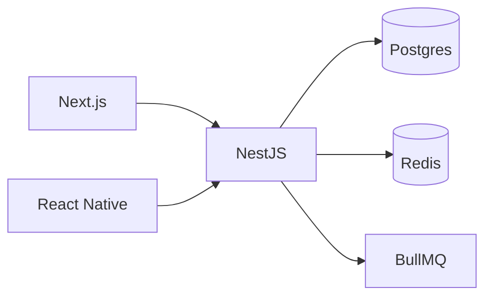

Vou dividir em  **conceitos → estrutura → fluxo diário → hábitos de elite** . No fim, templates pra copiar.

---

## Parte 1 — Os conceitos (o que é cada coisa)

### 1. Instruction files — o "cérebro" do agent

São markdown files que o agent lê **toda vez** que abre o projeto. Sem isso, agent inventa. Com isso, agent segue padrão.

#### `AGENTS.md` (Codex) / `CLAUDE.md` (Claude Code) / `.github/copilot-instructions.md` (Copilot)

**Mesma função, nomes diferentes.** É o documento mestre por repo.

**O que vai dentro:**

* Stack técnico (linguagens, frameworks, versões)
* Comandos importantes (`npm run dev`, `npm test`, `npm run lint`)
* Padrões de código (naming, estrutura de pastas)
* Regras de teste (DoD, coverage mínimo)
* Pegadinhas do projeto (gotchas, dependências esquisitas)
* Como commitar (conventional commits, branch naming)

**Tamanho ideal:** 1-3 páginas. Gigante = agent ignora final. Curto = agent inventa.

**Hierarquia (Codex/Claude Code):**

```
~/.codex/AGENTS.md          ← global, todos projetos
<repo>/AGENTS.md            ← projeto inteiro
<repo>/services/api/AGENTS.override.md  ← override em subpasta
```

O mais específico ganha.

---

### 2. Docs de produto e arquitetura

#### `VISION.md`

1 página. **Por que** o produto existe, **quem** usa, **qual problema** resolve. Sem isso, agent escolhe trade-offs errados.

#### `DOMAIN.md` ou `GLOSSARY.md`

Entidades de negócio, regras, vocabulário. Em SaaS Síndico: o que é Síndico vs Morador vs Boleto. Agent precisa saber a linguagem.

#### `ADR-NNN-titulo.md` (Architecture Decision Records)

**O documento mais subestimado.** Cada decisão arquitetural vira 1 ADR.

markdown

```markdown
# ADR-003: Auth com JWT em vez de session cookie

## Status
Aceito (2026-05-06)

## Contexto
Multi-tenant, mobile + web, precisa stateless pra escalar horizontal.

## Decisão
JWT com claims { user_id, tenant_id, role }. Refresh token em httpOnly cookie.

## Consequências
+ Stateless, escala fácil
+ Mobile usa mesmo endpoint
- Logout server-side precisa blocklist Redis
- Token revocation custa 1 round-trip Redis

## Alternativas consideradas
- Session cookie: rejeitado, não funciona bem mobile
- OAuth próprio: rejeitado, complexidade
```

**Por que importa:** sprint 5 o agent não vai esquecer por que escolheu JWT. ADR é memória de longo prazo.

#### `DESIGN.md` (ou `ARCHITECTURE.md`)

Visão geral em diagrama + texto. Como módulos conversam. Mermaid funciona bem porque agent lê.

markdown

```markdown
# Architecture

## High-level


## Boundaries

-**API**: stateless, horizontal scale
-**Worker**: processa fila, pode rodar em containers separados
-**DB**: source of truth, RLS por tenant_id

```


#### `PATTERNS.md`


Como tu **escreve código** nesse projeto. Nomeação, estrutura de pasta, como criar um endpoint novo, como criar um teste.


---


### 3. Workflow / processo


#### `WORKFLOW.md`


Como o time (tu + agents) trabalha. Onde tá o board, branch strategy, code review, deploy.


markdown

```markdown
# Workflow

## Board
GitHub Projects → SaaS Síndico Sprint Board

## Branch
-`main`: protegido, deploy automático
-`dev`: integração
-`feat/<task-id>-<slug>`: feature
-`fix/<issue-id>-<slug>`: bug

## PR
- Aberto contra `dev`
- CI verde obrigatório
- Squash merge

## Deploy
- Push em main → GitHub Actions → Hostinger via SSH
```

#### `CONTRIBUTING.md`

Como adicionar feature nova. Step-by-step. Agent segue isso pra novo módulo.

---

### 4. Tasks e sprints

#### `sprints/sprint-NN/SPRINT.md`

Objetivo do sprint, deliverables, riscos, dependências.

#### `sprints/sprint-NN/NN-titulo.task.md`

**Unidade atômica de trabalho.** Acceptance criteria, test plan, DoD, out of scope. Já mostrei template antes.

**Regra dourada:** task que não cabe em 1 PR pequeno (~300 linhas) vira 2 tasks.

---

### 5. Skills — capacidades reutilizáveis

Skill = pasta com `SKILL.md` que o agent carrega  **só quando relevante** . É como uma habilidade que ele aprende.

**Estrutura:**

```
.skills/
└── revisao-humanizada/
    ├── SKILL.md              # quando triggar, instruções
    ├── examples.md           # exemplos antes/depois
    └── scripts/
        └── check-aitone.sh   # opcional, código de apoio
```

**Diferença pra `AGENTS.md`:**

* `AGENTS.md` carrega **sempre** (sempre no contexto)
* Skill carrega **sob demanda** (agent decide quando usar baseado na descrição)

**Bom uso:**

* Skills que tu já tem (`revisao-humanizada`, `ey-matrix`, `video-prompt-builder`) — reutilizam know-how
* Skills de domínio: `playwright-e2e`, `nestjs-module-creator`, `react-component-tdd`
* Skills de processo: `pr-reviewer`, `release-notes-writer`

**Anatomia do `SKILL.md`:**

markdown

```markdown
---
name: nestjs-module-creator
description: Criar novo módulo NestJS com padrão CRUD + DTOs + service + controller + spec.
  Acionar quando user pedir "criar módulo X", "novo recurso Y", "endpoint CRUD para Z".
---

# Como criar módulo NestJS

## Trigger
Pedido pra criar novo módulo/resource/CRUD.

## Steps
1. Gerar com `nest g resource <nome>`
2. Adicionar DTOs com class-validator
3. Service usa injeção do PrismaService
4. Spec com supertest cobrindo happy path + 2 edge cases
5. Adicionar módulo no AppModule
6. Atualizar OpenAPI tags

## Padrão de DTO
```ts
exportclassCreateDto{
@IsString()@MinLength(3) name:string;
...
}
```

## Definition of Done

- [ ] Spec verde
- [ ] OpenAPI doc atualiza
- [ ] Endpoint testado com curl

```


Wesley já tem skills (`revisao-humanizada`, `video-prompt-builder`, `ey-matrix`, `higgsfield-prompt-builder`). É a forma certa de empacotar know-how.


---


### 6. Hooks — automação no ciclo de vida


Hooks são scripts que rodam **automaticamente** em eventos do agent. Tipo Git hooks, mas pro agent.


**Eventos típicos:**


* `pre-tool-use` — antes do agent chamar uma tool
* `post-tool-use` — depois (ex: lint automático após edit)
* `pre-commit` — antes de commitar
* `session-start` — abertura de sessão
* `session-end` — fim


**Casos reais úteis:**


bash

```bash
# .claude/hooks/post-edit.sh
# Roda lint + format toda vez que agent salva arquivo .ts
#!/bin/bash
if[["$1"== *.ts ]];then
  npx prettier --write "$1"
  npx eslint --fix "$1"
fi
```

bash

```bash
# .claude/hooks/pre-commit.sh
# Bloqueia commit se testes vermelhos
#!/bin/bash
npmtest --silent ||{echo"❌ Testes vermelhos";exit1;}
```

**Por que isso é poderoso:** agent não consegue "esquecer" de rodar lint. É infrastrutura, não disciplina.

Codex tem hooks via `config.toml`. Claude Code tem `.claude/hooks/`. Copilot tem hooks no settings.

---

### 7. Custom agents / subagents

Agents especializados pra tarefas específicas.

**Caso real:** em vez de 1 agent generalista, tu tem:

* `architect` — só desenha arquitetura, não escreve código
* `coder` — implementa
* `reviewer` — só revisa PR
* `tester` — só escreve testes
* `security` — caça vulnerabilidades

**Em Copilot:** `.github/copilot/<nome>.agent.md` com frontmatter
**Em Codex:** Agents SDK ou config layered
**Em Claude Code:** Task tool spawn de subagents

**Wesley já fez isso (DEV/CONTENT/GROWTH/MEDIA squads, `@gerente` orquestrador).** É exatamente esse padrão.

---

### 8. MCP — extensão de capacidades

MCP (Model Context Protocol) = plugins que dão tools novas pro agent.

**Stack típica de MCP pra dev:**

* `filesystem` — ler/escrever arquivos (essencial)
* `git` — operações git
* `github` — issues, PRs
* `postgres` — queries no DB local
* `playwright` — controle de browser
* `azure-devops` — boards (Wesley já usa)

**Por que importa:** com MCP certo, agent não precisa rodar `psql` no terminal — ele tem tool nativa pra query. Mais confiável, mais rápido.

---

## Parte 2 — Estrutura completa de um repo "AI-friendly"

```
sistema-sindico/
├── README.md                       # humano lê
├── AGENTS.md                       # ⭐ agent lê (Codex)
├── CLAUDE.md                       # ⭐ agent lê (Claude Code)
│   (ou symlink: CLAUDE.md → AGENTS.md)
│
├── .github/
│   ├── copilot-instructions.md     # ⭐ agent lê (Copilot)
│   ├── copilot/
│   │   ├── tdd.agent.md            # custom agent TDD
│   │   └── reviewer.agent.md       # custom agent code review
│   └── workflows/
│       ├── ci.yml                  # lint + test + e2e
│       └── dod.yml                 # gate de Definition of Done
│
├── .specs/
│   ├── product/
│   │   ├── VISION.md
│   │   ├── DOMAIN.md
│   │   └── PERSONAS.md
│   │
│   ├── architecture/
│   │   ├── DESIGN.md               # diagrama + boundaries
│   │   ├── PATTERNS.md             # como escrever código aqui
│   │   ├── ADR-001-stack.md
│   │   ├── ADR-002-auth-jwt.md
│   │   └── ADR-003-multi-tenant-rls.md
│   │
│   ├── workflow/
│   │   ├── WORKFLOW.md             # processo do time
│   │   ├── CONTRIBUTING.md         # como adicionar feature
│   │   └── RELEASE.md              # como fazer deploy
│   │
│   └── sprints/
│       ├── BACKLOG.md              # tudo que falta, prioridade
│       ├── sprint-01/
│       │   ├── SPRINT.md
│       │   ├── 01-auth-jwt.task.md
│       │   ├── 02-multi-tenant.task.md
│       │   └── 03-billing-asaas.task.md
│       └── sprint-02/
│           └── ...
│
├── .skills/                        # skills do projeto
│   ├── nestjs-module/
│   │   └── SKILL.md
│   ├── playwright-e2e/
│   │   └── SKILL.md
│   └── prisma-migration/
│       └── SKILL.md
│
├── .claude/
│   ├── hooks/
│   │   ├── post-edit.sh            # lint + format auto
│   │   └── pre-commit.sh           # bloqueia commit vermelho
│   └── settings.json
│
├── .codex/
│   └── config.toml                 # config local (sandbox, etc)
│
├── playwright.config.ts            # com trace/screenshot/video
├── e2e/                            # Playwright tests
└── src/                            # código
```

---

## Parte 3 — Fluxo diário pra entrega de "release por dia"

### Como o time da Anthropic faz (e como tu replica)

Anthropic não entrega 1 release/dia por mágica. Eles têm:

1. **Specs muito boas antes de codar** (eles chamam de "model spec", "behavior spec")
2. **Eval suite gigante** (testes automatizados que pegam regressão)
3. **CI extremamente robusto** (PR não merge se algo amarelo)
4. **Pequenos PRs frequentes** (não monolito de 1 mês)
5. **Documentação como código** (vive no repo, atualiza no PR)
6. **Async-first** (PR + comentário, não reunião)

Tu replica os 6 com 1 dev (tu) + N agents.

### Ciclo diário ideal

#### Manhã (1-2h, humano puro)

**07:00-08:00 — Planning**

* Lê stand-up notes do dia anterior (em `.specs/journal/YYYY-MM-DD.md`)
* Olha `BACKLOG.md`, escolhe 3-5 tasks pra hoje
* Escreve/refina cada `task.md` se ainda estiver vaga
* Atualiza ADR se decisão arquitetural emergiu ontem

**08:00-09:00 — Kick-off agents**

* Abre 3 worktrees paralelos:

bash

```bash
git worktree add../task-01 feat/01-auth
git worktree add../task-02 feat/02-tenant
git worktree add../task-03 feat/03-billing
```

* Em cada um:

bash

```bash
cd../task-01 && codex exec"executa 01-auth-jwt.task.md"
```

* Vai trabalhar em outra coisa ou monitorar

#### Meio-dia (revisão contínua, 30-60min)

* PRs aparecem em GitHub
* Revisa cada um (5-15min cada)
* Comentários inline → agent corrige no mesmo PR
* CI verde + tu OK = merge
* Agent pega próxima task automaticamente

#### Tarde (deep work humano + monitoring)

* Tu codifica o que  **só humano faz bem** : arquitetura nova, decisões de produto, refactor cross-cutting
* Agents continuam pequenas tasks em background
* Tu intervém só se CI vermelho recorrente (sinal de spec ruim)

#### Fim do dia (15min)

* Olha sprint board: progresso vs plano
* Atualiza `BACKLOG.md`
* Escreve `journal/YYYY-MM-DD.md`:

markdown

```markdown
# 2026-05-06
## Done
- PR #42 auth JWT
- PR #43 multi-tenant RLS
## Blocked
- Billing: Asaas API mudou contract, precisa investigar
## Tomorrow
- Subir billing após resolver Asaas
- Começar dashboard síndico
## Decisions
- ADR-005 criado: usar PgBouncer pra connection pool
```

* Agent lê isso amanhã pra contexto.

### Métrica que importa

Não é "linhas de código por dia". É:

* **Cycle time:** task aberta → merge. Meta: < 24h pra task pequena.
* **PR size mediano:** < 300 linhas. Maior = quebra em mais tasks.
* **Reverts:** se tu reverte > 1 PR/semana, sinal de spec ruim ou DoD frouxo.
* **Test coverage:** > 80% line, > 70% branch.

---

## Parte 4 — Hábitos de elite

### 1. **Spec antes de código, sempre**

Regra: nenhum agent abre IDE antes de tu ler a `task.md` e dizer "tá bom".

Tempo investido em spec  **economiza 10x em refactor** . Wesley disse "júnior produtivo turbinado" — júnior segue spec, sênior questiona spec. Spec ruim = output ruim.

### 2. **DoD com gate automático no CI**

Sem isso, agent declara "feito" toda hora, com testes meia-boca. Com isso, PR não merge, agent volta corrigir.

### 3. **PRs pequenos, frequentes**

Meta: 3-8 PRs/dia merged. Cada um < 300 linhas. Revisar 5x menos doloroso.

### 4. **Conventional commits + changelog automático**

`feat:`, `fix:`, `chore:`, `refactor:`. Ferramentas tipo `release-please` geram CHANGELOG.md sozinhas.

### 5. **Trunk-based + feature flags**

Esquece long-lived branches. Tudo merge em main rápido, feature flag desliga em produção até pronto. Agents trabalham melhor assim.

### 6. **Observability desde dia 1**

`pino` ou `winston`, structured logging. Agent debuga melhor com log JSON do que com `console.log`.

### 7. **Eval/regression suite que tu confia**

Sem teste em que tu confia, tu não consegue mover rápido. Investe semana 1 inteira em CI + Playwright + unit foundation. Depois colhe.

### 8. **Journaling diário**

5min no fim do dia salva 1h amanhã. Agent perde memória entre sessões, journal é a memória que sobrevive.

### 9. **Skills pessoais**

Tu já faz isso. Cada padrão repetitivo vira skill. Reutiliza entre projetos.

### 10. **Pair com agent, não delegação cega**

"Deixa rodando 7 sprints" funciona em terreno conhecido. Em terreno novo, tu fica perto, valida cedo.

---

## Parte 5 — Roadmap pra virar AI Agent Specialist

### Semana 1-2: Fundação

* Pegar 1 projeto teu (ex: SaaS Síndico) e adicionar TODA a estrutura acima
* Escrever AGENTS.md, VISION.md, DESIGN.md, 5 ADRs
* Setup Playwright + CI com gates
* Criar 3 skills do projeto

### Semana 3-4: Velocidade

* Quebrar próximas features em task.md atômicas
* Rodar 3 worktrees paralelos
* Medir cycle time, PR size
* Iterar AGENTS.md baseado nos erros do agent

### Mês 2: Maestria

* Custom agents especializados (architect, coder, reviewer)
* Hooks pra lint/format/test automáticos
* MCP servers customizados pro teu domínio
* Skills compartilhadas entre teus projetos

### Mês 3: Escala

* Multi-projeto: estrutura idêntica em AppDental, cyperglow, memoryiit
* Templates de repo (clona estrutura)
* Métricas: cycle time médio, releases/semana, defect rate
* Começar a vender esse know-how (productizar)
